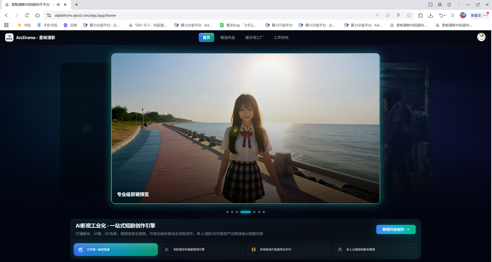
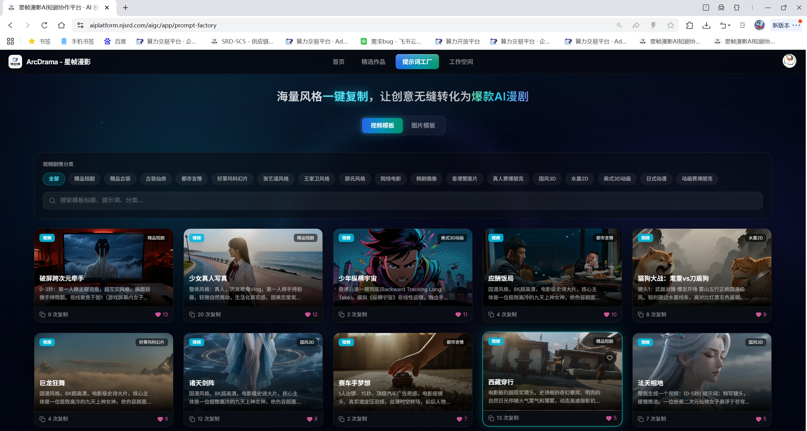
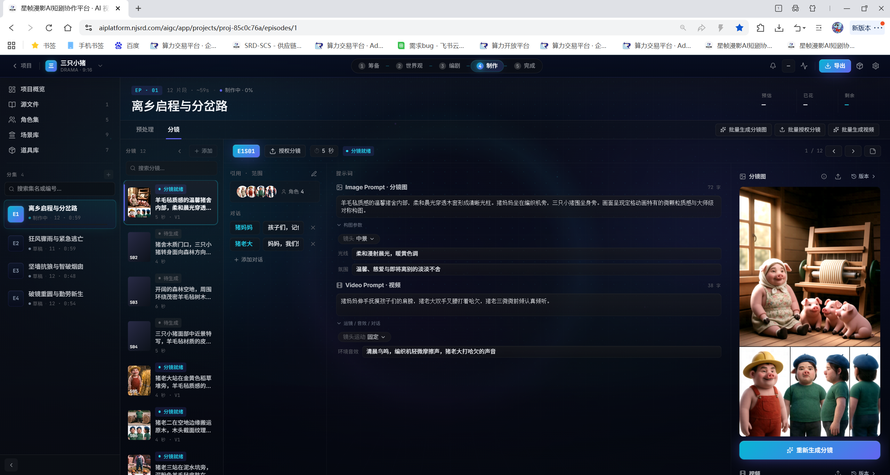
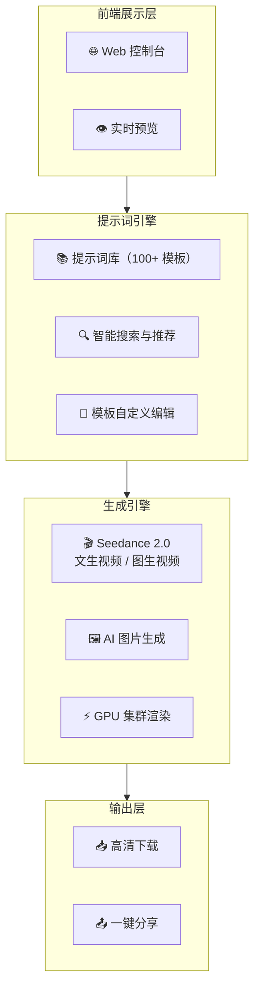

# 🎨 提示词工厂 — AI 视频与图片创作平台

> 海量提示词模板 × 满血 Seedance 2.0 —— 零门槛生成专业级 AI 短视频与漫剧。

[](https://aiplatform.njsrd.com/aigc/app/prompt-factory)
[]()
[]()

---

### 💬 加入社群

> 📱 扫码加入微信群，获取最新模板上线通知、优惠活动与技术交流。

<p align="center">
  
  <br/>
  <em>▲ 微信扫码加入交流群（如二维码过期请添加微信 zwl568633995）</em>
</p>

---

## 📖 项目简介

**提示词工厂** 是一个面向内容创作者的 AI 视频与图片生成平台。我们整理了覆盖影视、动漫、电商、Vlog 等数十个场景的专业提示词模板，搭载**满血 Seedance 2.0** 引擎，让你无需任何剪辑或 AI 基础，分钟级出片。

> 无论你是短视频博主、电商运营、还是动漫爱好者，选模板、改参数、一键生成，就能产出高质量的视频和图片内容。

**🌐 立即体验：[https://aiplatform.njsrd.com/aigc/app/prompt-factory](https://aiplatform.njsrd.com/aigc/app/prompt-factory)**

---

## ✨ 核心功能

| 功能 | 说明 |
|------|------|
| 📚 **海量提示词库** | 覆盖影视大片、二次元动漫、电商带货、Vlog 生活、节日营销等数十个分类 |
| 🎬 **AI 短视频生成** | 文生视频 / 图生视频，支持自定义时长、风格、运镜与画幅比例 |
| 📖 **AI 漫剧制作** | 批量生成分镜画面、自动配音配乐，合成完整有声漫剧 |
| 💪 **满血 Seedance 2.0** | 搭载最新一代视频生成引擎，画质细腻、动作流畅、物理世界还原度极高 |
| 🔧 **灵活参数调节** | 分辨率、帧率、创意强度、随机种子，精细控制每一次生成 |
| ⚡ **云端极速渲染** | GPU 集群加速，告别本地硬件焦虑 |

---

## 🎬 平台预览

### 操作演示

<!-- 拖入 Issue 获取 user-attachments 链接后替换下方 -->

https://github.com/user-attachments/assets/https://github.com/user-attachments/assets/41399b8a-ddff-477c-9a71-5e974897a0d7

### 界面截图

<p align="center">
  
  <br/>
  <em>▲ 首页 — 数十种分类提示词一览</em>
</p>

<p align="center">
  
  <br/>
  <em>▲ 提示词详情 — 预览效果 + 一键生成</em>
</p>

<p align="center">
  
  <br/>
  <em>▲ 生成结果 — 支持下载与二次编辑</em>
</p>

---

## 🎯 适用场景

| 场景 | 痛点 | 提示词工厂解决方案 |
|------|------|-------------------|
| 🎵 **短视频创作** | 没灵感、不会写脚本 | 一键套用爆款提示词模板 |
| 🛒 **电商带货** | 产品展示单调 | AI 生成动态商品展示视频 |
| 📖 **动漫创作** | 画功门槛高 | 漫剧模式批量出片 |
| 🎉 **节日营销** | 设计排期长 | 节日专题模板即改即用 |
| 📚 **知识科普** | 制作成本高 | 文字转视频，高效产出 |

---

## 🚀 快速上手

### 三步出片

```
① 选择分类与提示词模板
       ↓
② 调整参数（风格、时长、画幅）
       ↓
③ 点击生成 → 下载成品
```

1. 打开 [提示词工厂](https://aiplatform.njsrd.com/aigc/app/prompt-factory)
2. 浏览分类或搜索关键词找到合适提示词
3. 点击"使用此提示词"，按需修改内容
4. 选择视频 / 图片模式，设置参数
5. 点击生成，等待 Seedance 2.0 渲染完成
6. 下载或直接分享

---

## 🏗️ 技术架构



### 技术栈

- **视频引擎**: Seedance 2.0（满血版）
- **图片引擎**: Stable Diffusion / FLUX 系列
- **前端**: React + TypeScript + TailwindCSS
- **后端**: Python (FastAPI)
- **渲染集群**: NVIDIA A100 / H800
- **存储**: 分布式对象存储

---

## 📞 商务合作

> 📧 商务咨询 & 技术支持：**zwl568633995**（微信）  
> 🌐 提示词工厂：[https://aiplatform.njsrd.com/aigc/app/prompt-factory](https://aiplatform.njsrd.com/aigc/app/prompt-factory)  
> 🌐 公司官网：[https://aiplatform.njsrd.com/](https://aiplatform.njsrd.com/)

---

## 📄 License

本项目采用 [MIT License](LICENSE) 开源，欢迎 Star ⭐ 和贡献提示词模板。

---

<p align="center">
  <b>提示词工厂</b> —— 让每个人都能用 AI 做大片。
</p>
